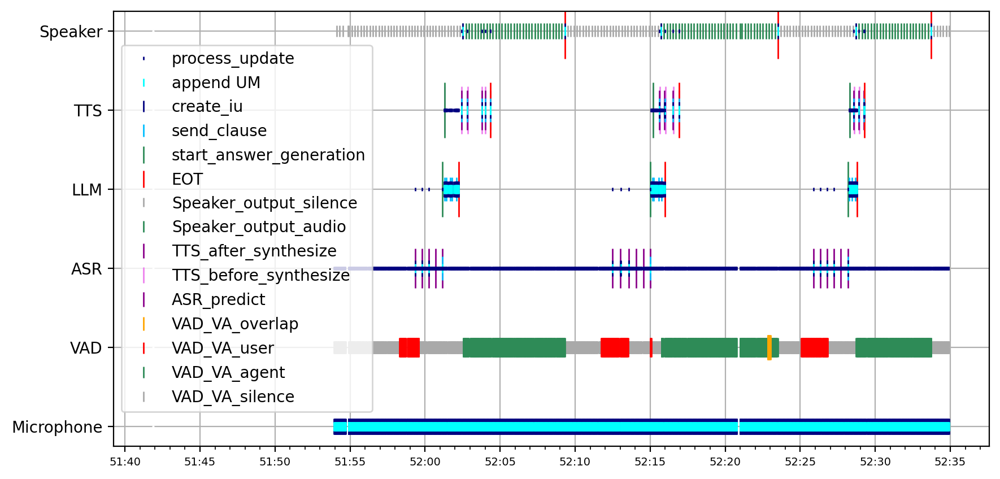
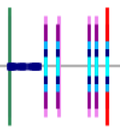

# Logging

The new logging system uses the library [structlog](https://www.structlog.org/en/stable/), that allows to create structured logging message. It is very easy to use, easily configurable and provides out-of-the-box pretty console output.

```python
import structlog
logger = structlog.get_logger()
logger.info("hello, world", some_data=[1, 2, 3])
>>> 2022-10-07 10:41:29 [info     ] hello, world   some_data=[1, 2, 3]
```

## Logger class

The `log_utils` module defines two logger singleton classes : `TerminalLogger` and `FileLogger`, and two class argument are set reference to their instances in the initialization of the `AbstractModule` class, which makes these two loggers accessible to every retico module through their argument `self.terminal_logger` and `self.file_logger`.

```python
# access the logger from any retio module, here it is from the Module 1 class :
self.terminal_logger.info("process_update", some_data=[1, 2, 3])
>>> 2022-10-07 10:41:29 [info     ] process_update   some_data=[1, 2, 3]
```

### Default log message data

Both loggers are configured so that every log message would have, by default, the following arguments : `timestamps`, `level` (the logging level), `event` (the string you give when you call the logger) and `module` (the module that produced the log message).

Here is an example of the log message produced by calling the `info` function of `file_logger` from the `Module` class:

```python
# from the Module 1 class
self.file_logger.info("process_update", some_data=[1, 2, 3])
>>> {"module": "Module 1", "event": "process_update", "level": "info", "timestamp": "2024-10-24T14:28:36.570572Z", "some_data"=[1, 2, 3]}
```

```{note}
The message presents a `module` attributes because it has been binded in the `__init__` of `AbstractModule` class (useful feature provided by `structlog`). Which means any call of `self.terminal_logger.info()` from `Module 1` will always have an argument `module="Module 1"`. You can bind any argument you want during your retico module's initialization.
```

### Terminal Logger

`TerminalLogger` is configured to print the log messages in the terminal, with a out-of-the-box pretty console output. You can log different level, exception tracebacks, etc.

[](https://www.structlog.org/en/stable/console-output.html)

### File Logger

`FileLogger` is configured to store, in a new log file for each system execution, every log message from every module. A log message is stored as a JSON (easy conversion because of the structured nature of logs and JSONs), i.e. each line of the file will be a JSON containing all the log message information.

```yaml
{"module": "Module 1", "event": "create_iu", "level": "info", "timestamp": "2024-10-24T14:28:36.571576Z"}
{"module": "Module 2", "event": "process_update", "level": "info", "timestamp": "2024-10-24T14:28:36.982043Z"}
...
```

## Configurate logging

The loggers are configured in `log_utils`, with the `configurate_logger` function. It is possible to filter out some logs on the fly, so that they are not stored or printed in the terminal, by giving the function a list of `filters`. Each filter is a function that checks some conditions on the log_message's data, and can raise a structlog.DropEvent to delete the log message. Some general filters are already defined in `log_utils`.

Example : Configuration that will filter all the `process_update` and `create_iu` events from `Module 1` :

```python
filters = [partial(retico_core.log_utils.filter_value_in_list, "Module 1", ["process_update", "create_iu"])]

# configure loggers
terminal_logger, file_logger = retico_core.log_utils.configurate_logger(
    "logs/run", filters=filters
)

m1 = Module1()
m2 = Module2()
m3 = Module3()

m1.subscribe(m2)
m2.subscribe(m3)

retico.network.run(m1)
```

## Configurate plotting

The logging system comes alongside a plotting system that provides the system with a basic execution vizualization. The system can create a plot (using `matplotlib`) of the system's execution from the log messages stored in the log file. This plot can be created either after the system's execution or in real time, the last option is presented in details in a section below.

|  |
|:--:|
| *A plot generated from the log file of a retico system's execution* |

You can configure the plotting system by calling `configurate_plot` function before running the system in your main. All parameters will be explained in the following sections.

```python
# configure plot
retico_core.log_utils.configurate_plot(
    is_plot_live=True,
    refreshing_time=1,
    plot_config_path="configs/plot_config.json",
    module_order=["Module 1", "Module 2"],
    window_duration=30,
)

retico.network.run(m1)
```

The configuration file (here `configs/plot_config.json`), is mandatory because it is used to specify which log message are retrieved from log file to create the plot. Which means that if you provide an empty json file, the resulting plot would also be empty. This configuration file is a JSON file, with a precise structure, where it is possible to specify every event from every module you want to plot.

Example : Plot configuration where I want to plot all `process_update` and `create_iu` log messages from `Module 1`, and only the `process_update` from `Module 2`.

```yaml
{
    "Module 1": {
        "events": {
            "process_update": {
            },
            "create_iu": {
            },
        }
    }
    "Module 2": {
        "events": {
            "process_update": {
            },
        }
    }
}
```

```{warning}
The **full module name** (result of the module's `name()` function) has to be put in the configuration file, an exact macthing will be checked during the `plot()` function.
```

### Module names in plot's y-axis

The **name** of the modules in the plot's y axis is the first word of the module's name (the result of the module's `name()` function), i.e. the substring corresponding to all characters before the first space character. So a module called `ASR Whisper Module` will be designated as `ASR` in the plot.

Which means that the two modules `Module 1` and `Module 2` in the example above would both be designated as `Module` in the y-axis of the plot. It probably would have been better to named them `Moule_1` or `First Module`... In any case make sure the first word describes your Module well enough.

The **order** of the modules in the y-axis is corresponds their order in the configuration file, which means that, in the example above, the `Module 1` will be above `Module 2` in the plot's y-axis.

### Plot config key words

The `plot` function in `log_utils` uses some key words to easily configurate the plot and have shorter plot configuration file :

- `any_module` : If you want to plot all `process_update` log messages from every module, you can use the `any_module` key word.
- `other_events` : If you want to plot all log messages from a module, you can use the `other_events` key word.
- `exclude` : If you want to exlude a log message from the plot, you can use the `exclude` key word.

Here is an minimal example of the configuration file using these key words : The plot would contain all `create_iu` log message from all modules, except for `Module 1` because its `create_iu` logs are explicitly excluded. It will also contains all the log messages from `Module 1` that are not `create_iu`.

```yaml
{
    "any_module": {
        "events": {
            "create_iu": {
            }
        }
    },
    "Module 1": {
        "events": {
            "create_iu": {
                "exclude": true,
            },
            "other_events": {
            }
        }
    }
}
```

### Customize plot's markers

You can customize the `matplotlib`'s markers attributes for each log message on your config (and it is recommended to do so for clarity). The following attributes will be used as arguments in the `matplotlib.plot()` calls.

- `marker` : the marker you want to use for this log message.
- `marker_color` : the marker color you want to use for this log message.
- `marker_size` : the marker size you want to use for this log message.

```{note}
For more information, read `matplotlib` documentation : [matplotlib.plot() documentation](https://matplotlib.org/stable/api/_as_gen/matplotlib.axes.Axes.plot.html#matplotlib.axes.Axes.plot).
```

If no customization is given in the config (like it is below, for `create_iu` log messages from `any_module`), a default grey line will be plotted.

#### Markers superposition and priority

Two log messages from the same module with the same timestamp will be superposed at the same place in the plot. The marker that will be in front of the other is the one that is described first in the config file. In the example below, it means that if a `process_update` and a `create_iu` log from `Module 1` have the same timestamp, the `process_update` marker will be in front of the `create_iu` marker.

```{note}
If you want to be able to see the superposition of markers, configure the size of the markers so that the first in the config have the smallest size (like it is in the config file example below).



*A superposition of multiple markers clearly visible because of the size difference*

```

```yaml
{
    "Module 1": {
        "events": {
            "process_update": {
                "plot_settings": {
                    "marker": "|",
                    "marker_color": "blue",
                    "marker_size": 10
                }
            }
        }
    },
    "any_module": {
        "events": {
            "process_update": {
                "plot_settings": {
                    "marker": "x",
                    "marker_color": "red",
                    "marker_size": 10
                }
            },
            "create_iu": {
                "plot_settings": {
                    "marker": "x",
                    "marker_color": "red",
                    "marker_size": 18
                }
            },
            "other_events": {}
        }
    }
}
```

#### plot_settings priority

As you can define the `plot_settings` markers attributes for the key words, a log message can fall into multiple categories. In the example above, the `process_update` messages from `Module 1` fall into 2 categories : `process_update` from `Module 1` and `process_update` from `any_module` (the marker could be a blue line or a red cross).
That means the `plot` function had to define an priority order to have a general policy on how to chose one `plot_settings` if a log message corresponds to mutiple categories.

The priority order is the following :

1. the log message matches with a specified event name, under a specified module name, in the plot config (`Module 1` -> `process_update`).
2. the log message matches with a specified event name, under the `any_module` key word (`any_module` -> `process_update`).
3. the log message matches with the `other_events` key word, under a specified module name (`Module` -> `other_events`).
4. the log message matches with the `other_events` key word, under the `any_module` key word (`any_module` -> `other_events`). (any event from any module would match this category if it is in the plot config file)

Which means that in the above example, `process_update` log messages from `Module 1` would be plotted as blue lines.

### Plotting in real time

As presented in the plotting section's introduction, you can configurate the plotting system to create plots in real time, i.e., as your retico system is running. If you do so, a separate thread will be instanciated, that will periodically load the log file, then generate and save a plot from the log messages.

To configure the plotting system in real time, there is 3 parameters :

- `is_plot_live` : by setting this parameter to True, you simply enables the plotting in real time.
- `refreshing_time` : By default, a plot will be generated every `5` seconds, but you can modify this duration by setting `refreshing_time`, with the desired number of seconds between two generations.
- `windows_duration` : You can chose to only plot the log messages from the last *m* seconds by setting the `windows_duration` parameter. It can be useful to vizualize only new log messages to analyze precise systems behaviors (without having the 2+ min old log messages).

```python
# configure plot
retico_core.log_utils.configurate_plot(
    is_plot_live=True,
    refreshing_time=1,
    plot_config_path="configs/plot_config.json",
    window_duration=30,
)

retico.network.run(m1)
```
